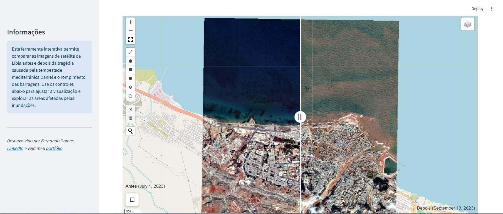

# 🌍 Libya Floods 2023 Split Map  

## 📊 Sobre o Projecto  
Este projeto visa a visualização interativa das inundações ocorridas na Líbia em 2023, utilizando mapas divididos para comparar diferentes camadas de dados geoespaciais, como imagens de satélite antes e depois do evento, áreas afectadas, e infraestrutura crítica. O objectivo principal é oferecer uma ferramenta de fácil uso para análise geográfica e conscientização sobre o impacto das inundações.  

## 🎯 Objectivos  
- Visualizar dados espaciais das inundações na Líbia.  
- Comparar dados pré e pós-desastre utilizando um mapa dividido.  
- Oferecer insights interativos para pesquisadores, ONGs e formuladores de políticas públicas.  

## 🛠️ Ferramentas Utilizadas  
- **Streamlit**: Interface interativa e acessível para visualização web.  
- **Leafmap**: Visualização espacial poderosa com suporte a mapas interativos.  
- **Python**: Linguagem base para manipulação de dados e visualizações.  

## 🗺️ Funcionalidades do Aplicativo  

### 🔍 Mapa Dividido (Split Map)  
- Comparação lado a lado de imagens de satélite antes e depois das inundações.  
  

### 🌍 Análises Geoespaciais  
- Identificação de áreas mais afetadas.  
  

### 📈 Insights e Visualizações  
- Resumo dos impactos em infraestrutura e áreas urbanas.  


## 💻 Como Rodar o Projeto  

### ✅ Requisitos  
- Python 3+  
- Navegador web actualizado  

### 🛠️ Instalação  
1. Clone este repositório:  
   ```bash  
   git clone https://github.com/fernandogomesfg/libya-floods-2023-split-map.git  
   cd libya-floods-2023-split-map  
   ```  

2. Crie um ambiente virtual:  
   ```bash  
   python -m venv venv  
   source venv/bin/activate  # macOS/Linux  
   venv\Scripts\activate     # Windows  
   ```  

3. Instale as dependências:  
   ```bash  
   pip install -r requirements.txt  
   ```  

4. Inicie a aplicação Streamlit:  
   ```bash  
   streamlit run app/main.py  
   ```  

5. Acesse no navegador:  
   ```
   http://localhost:8501  
   ```  


## 🎨 Demonstração  

### Mapa Dividido (Split Map)  


*Nota: O mapa interativo permite alternar camadas e ajustar o zoom para análise detalhada.*  

## 💡 Entrega de Valor  

### 🎯 Benefícios do Projecto  
- **Tomada de Decisão Informada**: Ferramenta útil para organizações de ajuda humanitária e gestores públicos.  
- **Análise Comparativa**: Permite identificar padrões de danos e priorizar intervenções.  
- **Simplicidade de Uso**: Interface acessível para usuários com diferentes níveis de expertise.  

### 🌍 Aplicabilidade  
- **Agências Governamentais**: Planejamento urbano e mitigação de riscos futuros.  
- **Organizações Humanitárias**: Coordenação de esforços de ajuda.  
- **Pesquisadores**: Estudos sobre mudanças climáticas e desastres naturais.  

## 📜 Licença  
Este projeto está licenciado sob a [Licença MIT](LICENSE).  

## 👨‍💻 Autor  
Desenvolvido por Fernando Gomes.  

### 🔗 Links Relevantes  
- [Meu Portfólio](https://fernandogomesfg.github.io/)  
- [Conecte-se no LinkedIn](https://www.linkedin.com/in/fernandogomesfg/)  
